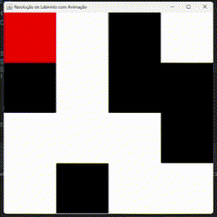
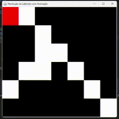
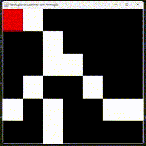

# Técnicas de Programação Avançada - TP1
## Resolução de Labirinto com Animação em Java
> Por Alex R. Junior e João P. Pagotto

Este projeto implementa a resolução de um labirinto utilizando busca em profundidade (DFS) e exibe a solução visualmente em uma interface gráfica usando JFrame e JPanel. O labirinto é lido de um arquivo CSV, onde 0's representam paredes e 1's representam caminhos. A interface destaca o progresso da resolução alterando as cores das células.

## Pré-requisitos

- Java JDK (versão 8 ou superior)
- Editor de código ou IDE (Eclipse, IntelliJ, VS Code, etc.)
- Bibliotecas usadas: O código utiliza apenas biblioteca padrão do Java.

## Compilação e Execução

1. Clone ou baixe o repositório:
```
git clone https://github.com/alexrossoni/TPA-Labirinto.git
```
```
cd TPA-Labirinto
```

2. Certifique-se de que o arquivo CSV chamado **'labirinto.csv'** esteja no diretório correto (mesmo diretório do código). O arquivo CSV deve ter a seguinte estrutura:
```
1,1,0,1,1
0,1,0,0,1
1,1,1,0,1
1,0,1,1,1
```

3. Compile o código
```
javac Main.java
```

4. Execute o programa
```
java Main
```

## Entrada e Saída

- `Entrada`: O programa lê o arquivo labirinto.csv no formato de uma matriz, onde 1 representa um caminho e 0 uma parede. O ponto de entrada é **sempre** a posição (0,0) e a saída é **sempre** a última célula da matriz.


- `Saída`: A animação do caminho encontrado será exibida em uma janela gráfica. Além disso, o labirinto com o caminho encontrado será impresso no console, onde o caminho será representado por 'X'.

## Estrutura do Código

1. `Main - JFrame`: O construtor Main(int[][] labirinto) inicia a interface, criando um JPanel para cada 'quadrado' do labirinto, onde as paredes são pretas e os caminhos são brancos.


2. `atualizarCelula(int x, int y)`: Esta função é responsável por controlar a animação do algoritmo.
   - Atualiza a cor da célula atual para vermelho, indicando que o algoritmo está explorando essa posição.
   - Restaura a cor da última célula explorada para a cor original.
   - Pausa a execução do programa por 500ms para controlar a velocidade da animação.


3. `resolverLabirintoComAnimacao(int x, int y)`: Implementa o algoritmo de busca em profundidade para encontrar o caminho do labirinto.
   - Verifica se a célula atual é válida (dentro dos limites da matriz e não é uma parede).
   - Marca a célula como visitada.
   - Verifica se a célula atual é a saída do labirinto.
   - Explora recursivamente as oito direções possíveis (cima, baixo, esquerda, direita e diagonais).
   - Desfaz o caminho caso não encontre a solução.


4. `lerLabirintoCSV(String caminhoArquivo)`: Lê o arquivo labirinto.csv e converte seus valores para uma matriz


5. `imprimirLabirinto()`: Imprime a matriz final no console caso exista um caminho válido. O caminho encontrado é mostrado por uma sequência de 'X'.


## Exemplos de Uso

### Exemplo 1

#### Entrada
O arquivo labirinto.csv tem o seguinte formato que pode ser modificado, mas tenha atenção ao fazer isto. Exemplo:
```
1,1,0,1
0,1,0,0
1,1,1,0
1,0,1,1
```

#### Saída
Durante a execução, uma janela será exibida com a animação da resolução do labirinto. O console mostrará o caminho encontrado:
```
X X 0 1 
0 X 0 0 
1 X X 0 
1 0 X X 
```

#### Animação
Clique no GIF para visualizar a animação da resolução do exemplo



### Exemplo 2

#### Entrada
```
1,1,0,0,0,0,0
0,0,1,0,0,0,0
0,0,1,1,0,0,0
0,1,1,0,1,0,0
1,0,0,0,0,1,0
0,0,0,0,0,0,1
```

#### Saída
```
X X 0 0 0 0 0 
0 0 X 0 0 0 0 
0 0 X X 0 0 0 
0 1 X 0 X 0 0 
1 0 0 0 0 X 0 
0 0 0 0 0 0 X 
```

#### Animação


### Exemplo 3

#### Entrada
```
1,1,0,0,0,0,0
0,0,1,0,0,0,0
0,0,1,1,0,0,0
0,1,0,0,1,0,0
1,0,1,0,0,1,1
0,0,1,0,0,0,0
```

#### Saída
```
Nenhum caminho encontrado.
```

#### Animação

